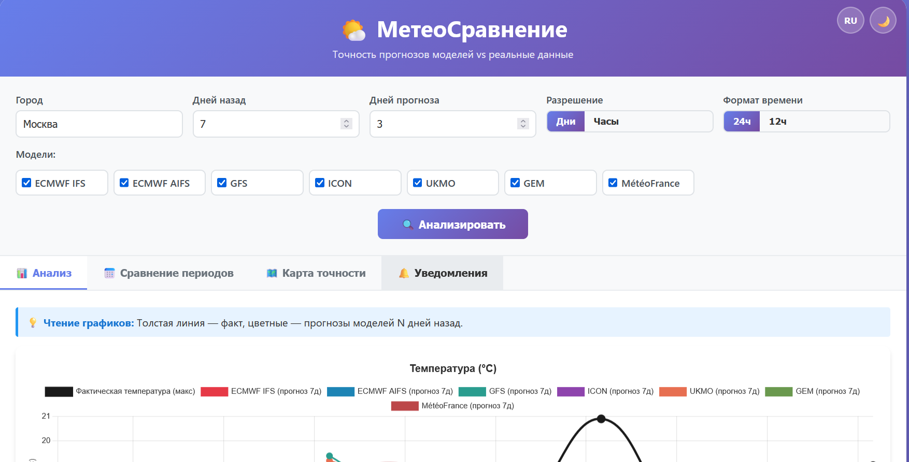
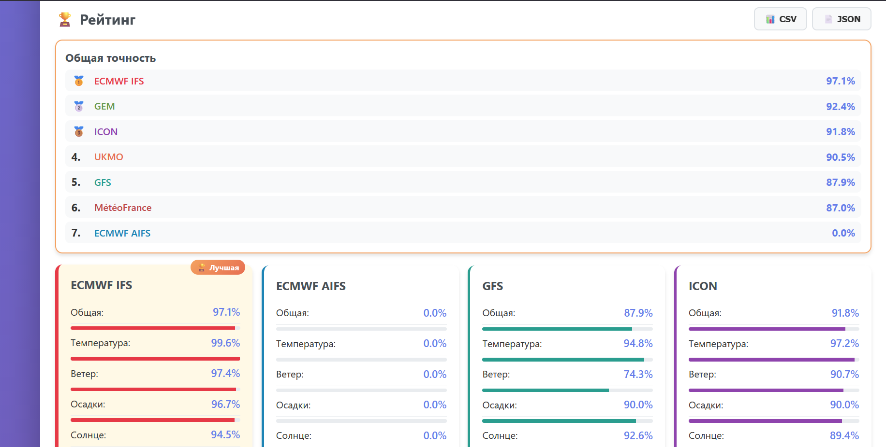
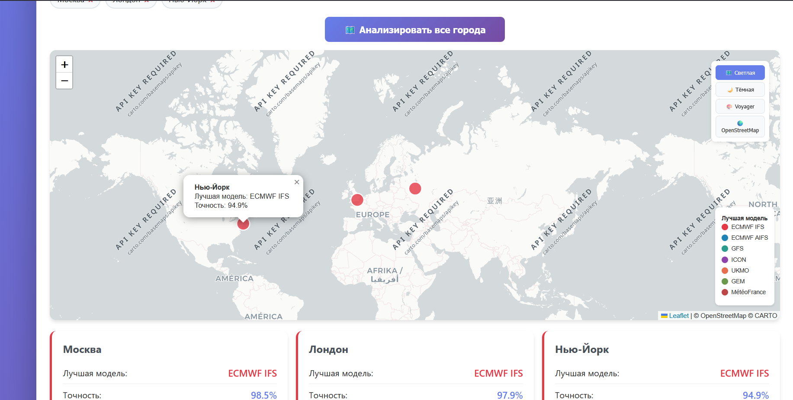
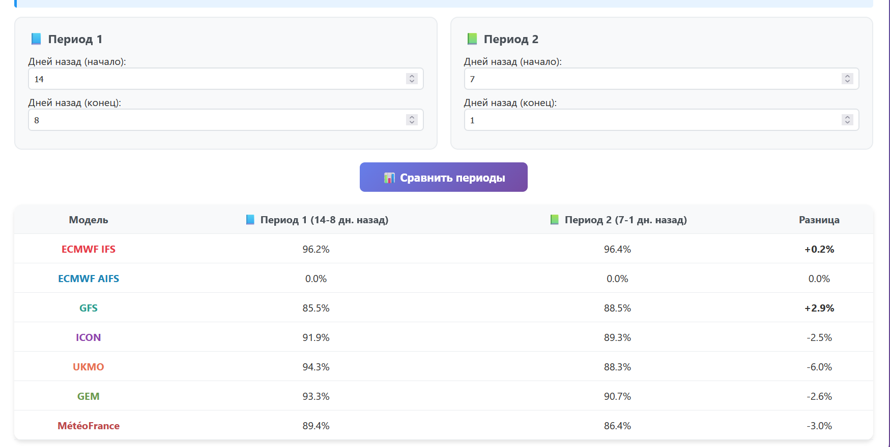
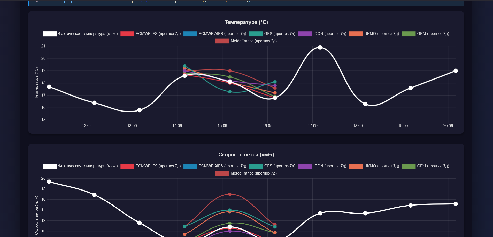
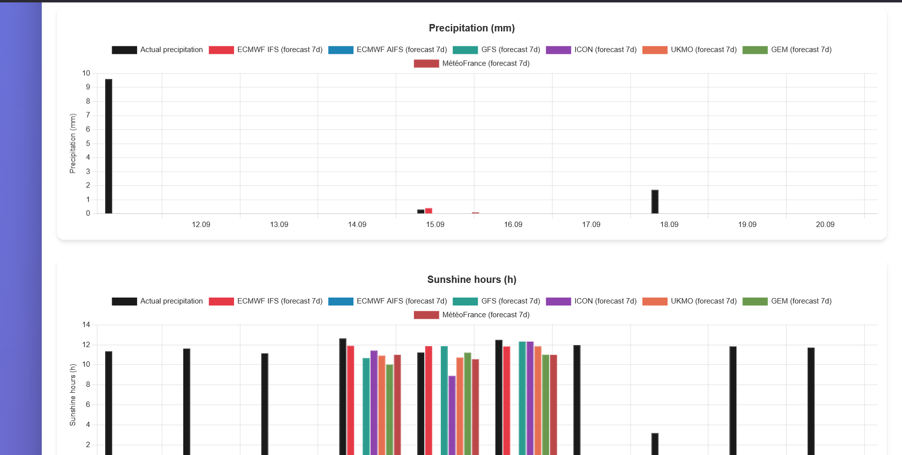

# 🌤️ МетеоСравнение / MeteoCompare
<div align="center">

**🌍 Язык: [English](README.md) | [Русский](RREADME_RU.md)**

</div>

---
[](https://j4rest.github.io/weather-dashboard/)
[](LICENSE)
[](#)

> **Бесплатный инструмент для анализа точности метеорологических моделей**  
> Сравните прогнозы ECMWF, GFS, ICON и других моделей с реальными наблюдениями

🔗 **[Открыть дашборд →](https://j4rest.github.io/weather-dashboard/)**

---

## 📖 О проекте

**МетеоСравнение** — это веб-приложение, которое накладывает прогнозы метеомоделей, сделанные N дней назад, на фактические данные наблюдений. Вы буквально видите точность каждой модели на временной шкале!

Приложение использует бесплатный API [Open-Meteo](https://open-meteo.com/) и работает полностью в браузере — без серверов и регистрации.

---

## 📸 Скриншоты

### 🌡️ Анализ температуры и ветра


*Сравнение прогноза ECMWF IFS с фактической температурой в Москве*

### 🏆 Рейтинг моделей


*Автоматический расчёт точности по 4 метрикам: температура, ветер, осадки, солнце*

### 🗺️ Карта точности


*Лучшая модель для каждого города мира — визуализация на интерактивной карте*

### 📅 Сравнение периодов


*Узнайте, как меняется точность моделей в разные периоды*

### 🌙 Тёмная тема


*Комфортная работа в любое время суток*

### 🌐 Мультиязычность


*Полная поддержка русского и английского языков*

---

## ✨ Возможности

### 📊 Анализ точности
- Сравнение прогнозов **7 моделей** (ECMWF IFS, AIFS, AIGFS, GFS, ICON, UKMO, GEM, MétéoFrance)
- **4 метрики точности**: температура, ветер, осадки, солнечные часы
- Визуализация на графиках с цветными линиями для каждой модели
- Автоматический **рейтинг моделей** с медалями 🥇🥈🥉

### 🗺️ Карта точности
- Интерактивная карта мира (Leaflet + OpenStreetMap)
- Анализ нескольких городов одновременно
- Цветные маркеры показывают лучшую модель для каждого региона
- 4 стиля карты на выбор (светлая, тёмная, Voyager, OSM)

### 📅 Сравнение периодов
- Сравните точность моделей в разные периоды
- Узнайте, какая модель лучше зимой vs летом
- Таблица с цветовой индикацией улучшений/ухудшений

### 🔔 Уведомления
- Настраиваемые пороги точности
- Алерты при больших ошибках температуры
- Журнал всех уведомлений

### 📱 PWA и офлайн-режим
- Установка как приложение на телефон/компьютер
- Работа без интернета (Service Worker)
- Адаптивный дизайн для мобильных устройств

### 🌐 Мультиязычность
- Полная поддержка **русского** и **английского** языков
- Переключение одним кликом
- Динамическое обновление всех текстов и графиков

### 💾 Экспорт данных
- Экспорт в **CSV** (для Excel/Google Sheets)
- Экспорт в **JSON** (для программной обработки)

### 🎨 Настройки
- Тёмная/светлая тема
- Дневное/часовое разрешение
- Формат времени 24ч / 12ч (AM/PM)
- Автосохранение всех настроек в браузере

---

## 🛠️ Технологический стек

| Технология | Назначение |
|------------|------------|
| **HTML5 / CSS3** | Структура и стили |
| **Vanilla JavaScript** | Логика приложения |
| [Chart.js](https://www.chartjs.org/) | Интерактивные графики |
| [Leaflet](https://leafletjs.com/) | Интерактивная карта |
| [Open-Meteo API](https://open-meteo.com/) | Метеоданные (бесплатно) |
| [CartoDB](https://carto.com/) | Тайлы карты |
| **GitHub Pages** | Хостинг |

---

## 🚀 Быстрый старт

### Онлайн (без установки)
Просто откройте: **[https://j4rest.github.io/weather-dashboard/](https://j4rest.github.io/weather-dashboard/)**

### Локально
1. Скачайте репозиторий:
   ```bash
   git clone https://github.com/j4rest/weather-dashboard.git
   cd weather-dashboard
